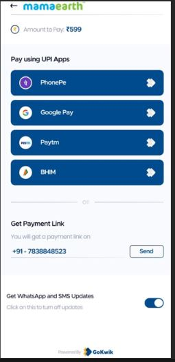

# PaymentOptions

## 📜 Overview
**PaymentOptions** is a React component designed for efficient payment processing with multiple UPI (Unified Payments Interface) options, optimized for mobile and iOS devices.

## 🛠 Installation

1. **Clone the Repository**
    ```bash
    git clone https://github.com/Gaurav6342/PaymentOptions-UI-for-GokWik.git
    cd PaymentOptions
    ```

2. **Install Dependencies**
    ```bash
    npm install
    ```

3. **Run the Project**
    Run the following commands in the main directory:
    ```bash
    npm start
    json-server --watch db.json --port 8080
    ```

## 📸 Output

### Preview


### Assignment Part 1
[Watch Video](https://www.loom.com/share/ce10b57e3cbb47128ee6460173ab62e9)

### Assignment Part 2
[Watch Video](https://www.loom.com/share/2948a308b0364ff78e227bb38f0e2520)

